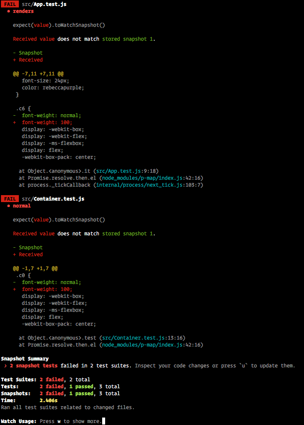

This is my test bed for styled-components and Jest snapshot testing.

## Motivation

Currently, if you are doing snapshot testing with styled components, it can generate unwated noise
during testing.

A snapshot can fail if:

1. The subject under test (SUT) has changed its style.
2. Any component that SUT renders has changed its style.
3. The `className` of SUT has changed.

For cases 2 and 3, it can make it hard to detect actual regression when changing one component
results in ten or more failures. Doing manual diffing becomes difficult.

When using [jest-styled-components](https://github.com/styled-components/jest-styled-components), it helps
with styling regression. However, another way to use snapshot testing it to ensure that the correct
component hierarchy is rendered, with the correct props. In theses cases, style changes should not
affect outcome of the test.

---

Here is an example of changing the [`Container`](./src/Container.js) component style, which results in the [`App` test](./src/App.test.js) also breaking.

In this case, one can argue that the `App` test should not fail since it is still rendering the correct
thing.
